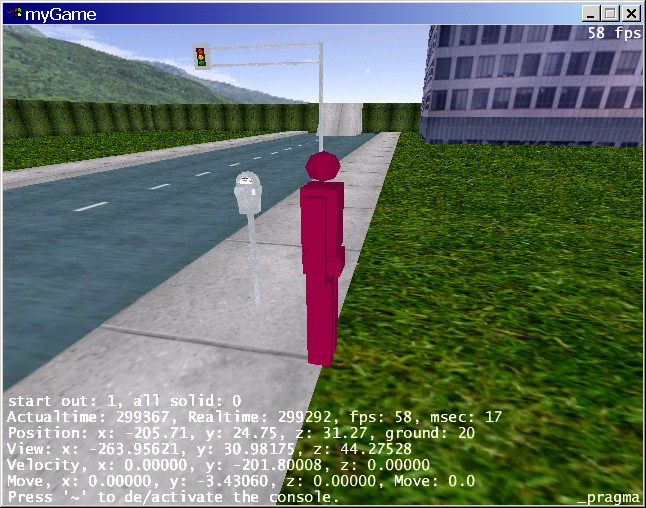

# assimilate3d

assimilate3d is a simple Quake-like OpenGL 3D engine

# Features

* Cross-platform: Linux, Windows, Mac
* SDL and OpenGL support.
* TGA texture support.
* Basic font support.
* Quake3 BSP tree support
* Binary MilkShape3d model support w/textures.
* Quake-style console with transparency, animation, background textures.
* Quake-style console commands: `set`, `unset`, `cvars`, `alias`, `bind`, `exec`, `connect`, `map`, etc
* Quake-style console variables and interpolation, aliasing, etc
* Easy keybindings and keynames; e.g. `bind escape quit`, `bind mouse1 +attack`, `bind w +forward`
* Console variables expand in strings, eg: `set foo 1; echo $foo` -- prints `1`
* Can `exec` configuration scripts; e.g. see [mygame.cfg](mygame.cfg)
* Tons of console variables controlling state and behavior of game engine
* Skyboxes
* Very basic physics

Check out the [screenshots](screenshots)!
